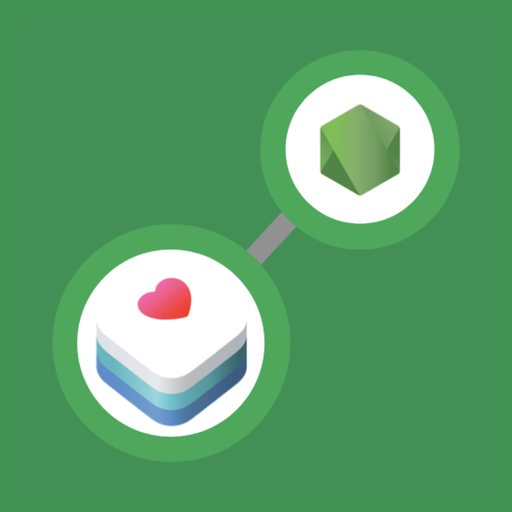
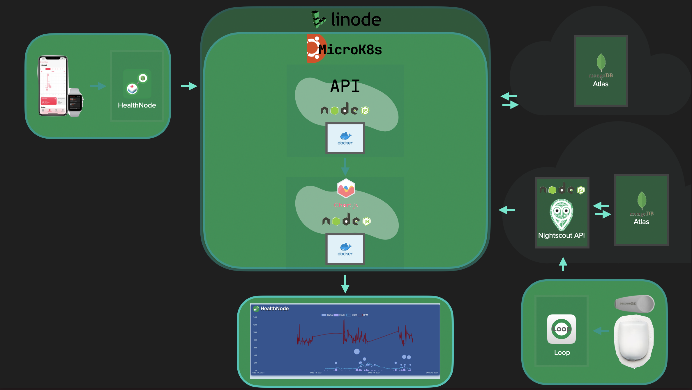

 

  

<h3 align="center">HealthNode</h3>

  

    Living with diabetes type 1 is a great hazzle trying to find balance between carbs and
    insulin. Since there are multiple factors besides the two mentioned above, this project
    aims at visualising the correlation between physical activity and glucose levels in the blood.
     
     
    <a href="https://github.com/codebymini/healthnode"><strong>Explore the docs »</strong></a>
     
    ·
    <a href="https://github.com/codebymini/healthnode/issues">Report Bug</a>
    ·
    <a href="https://github.com/codebymini/healthnode/issues">Request Feature</a>
  

  
Table of Contents

  <ol>
    <li>
      <a href="#about-the-project">About The Project</a>
      <ul>
        <li><a href="#built-with">Built With</a></li>
      </ul>
    </li>
    <li>
      <a href="#getting-started">Getting Started</a>
      <ul>
        <li><a href="#prerequisites">Prerequisites</a></li>
        <li><a href="#installation">Installation</a></li>
      </ul>
    </li>
    <li><a href="#usage">Usage</a></li>
    <li><a href="#roadmap">Roadmap</a></li>
    <li><a href="#contributing">Contributing</a></li>
    <li><a href="#license">License</a></li>
    <li><a href="#contact">Contact</a></li>
    <li><a href="#acknowledgments">Acknowledgments</a></li>
  </ol>

 

## About The Project

This is a multipart project containing an iPhone app, Back- and Front-end in Node.js and Kubernetes deployment definitions. It also utilize a Atlas MongoDB.

The repositories used in this project:
* <a href="https://github.com/CodeByMini/HealthNode">HealthNode</a>
* <a href="https://github.com/CodeByMini/HealthNodeApp">HealthNodeApp</a>
* <a href="https://github.com/CodeByMini/HealthNodeApi">HealthNodeApi</a>
* <a href="https://github.com/CodeByMini/HealthNodeWeb">HealthNodeWeb</a>

(<a href="#top">back to top</a>)

## System Overview

(<a href="#top">back to top</a>)

### Built With
* [React.js](https://reactjs.org/)

(<a href="#top">back to top</a>)

## Getting Started

### Prerequisites

### Installation

(<a href="#top">back to top</a>)

## Usage

(<a href="#top">back to top</a>)

## Contributing

Contributions are what make the open source community such an amazing place to learn, inspire, and create. Any contributions you make are **greatly appreciated**.

If you have a suggestion that would make this better, please fork the repo and create a pull request. You can also simply open an issue with the tag "enhancement".
Don't forget to give the project a star! Thanks again!

1. Fork the Project
2. Create your Feature Branch (`git checkout -b feature/AmazingFeature`)
3. Commit your Changes (`git commit -m 'Add some AmazingFeature'`)
4. Push to the Branch (`git push origin feature/AmazingFeature`)
5. Open a Pull Request

(<a href="#top">back to top</a>)

## License

Distributed under the MIT License. See `LICENSE.txt` for more information.

(<a href="#top">back to top</a>)

## Contact

Daniel Mini Johansson - daniel@codebymini.se

[![LinkedIn][linkedin-shield]][linkedin-url]

Project Link: [https://github.com/codebymini/healthnode](https://github.com/codebymini/healthnode)

(<a href="#top">back to top</a>)

[license-shield]: https://img.shields.io/github/license/codebymini/healthnode.svg?style=for-the-badge
[license-url]: https://github.com/codebymini/healthnode/blob/master/LICENSE.txt
[linkedin-shield]: https://img.shields.io/badge/-LinkedIn-black.svg?style=for-the-badge&logo=linkedin&colorB=555
[linkedin-url]: https://linkedin.com/in/https://www.linkedin.com/in/daniel-johansson-4b099219a/
